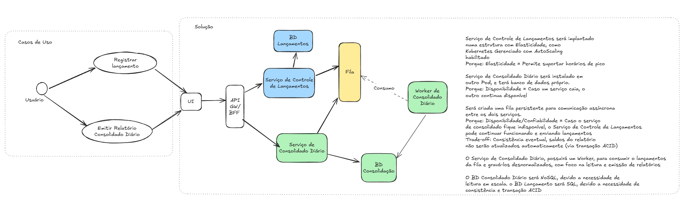

## Contexto

Este projeto é uma Proposta Arquitetural para resolução do seguinte problema:

Um comerciante precisa controlar o seu fluxo de caixa diário com os lançamentos (débitos e créditos), também precisa de um relatório que disponibilize o saldo diário consolidado.

## Requisitos de negócio

- Serviço que faça o controle de lançamentos
- Serviço do consolidado diário

## Arquiteturas candidatas

Devido a natureza dos requisitos e especificação, é necessário a utilização de um modelo de Arquitetura Distribuído, com no mínimo 2 serviços independentes. O Serviço de consolidado diário terá seus dados gerados no Serviço de controle de lançamentos, ou seja é necessária uma integração entre os serviços. 

## Arquitetura selecionada

O uso de Arquitetura Distribuída em serviços, se prova mais adequedada nesse cenário devido a disponibilidade exigida para o Serviço de Controle de Lançamentos ("O serviço de controle de lançamento não deve ficar indisponível se o sistema de consolidado diário cair."). Aqui está incluída também a necessidade de banco de dados separados para cada um dos serviço, novamente visando o desacoplamento, e entendendo que as operações entre os serviços tem natureza diferente. O Serviço de Controle de Lançamento deve utilizar um banco de dados com suporte a transações ACID de consistência imediata, enquanto o Serviço de Consolidado Diário, necessita de uma base de dados otimizada para leitura (devido a geração de relatórios), que atenda o RNF "Em dias de picos, o serviço de consolidado diário recebe 50 requisições por segundo, com no máximo 5% de perda de requisições."

Com o uso de Arquitetura de distribuída, e serviços separados, traz a necessidade de integração entre os serviços. Para integração, os seguintes padrões são viáveis:

### ETL
O serviço de consolidado diário faz consultas periódicas a base de dados do Serviço de Controle de Lançamentos e armazenada os dados desnormalizados e otimizados para consulta em base própria.

Vantangens:
- Simplicidade
- Menos componentes a serem mantidos
- Menor custo (inicial)

Desvantagens:
- Acoplamento mais forte entre os serviços
- Desempenho: as consultas podem afetar o desemepenho do Serviço de Controle de Lançamentos

### Mensageria
O serviço de Controle de Lançamentos envia um payload para uma fila persistente assim que o lançamento é registrado. O serviço de Consolidado Diário consome a fila e grava os registros numa base própria

Vantagens:
- Menor acoplamento
- Escalabilidade
- Desempenho
- Possibilidade de reprocessamento sem acionar o Serviço de Lançamentos

Desvantanges:
- Maior complexidade
- Maior custo inicial

Analisando os Requisitos não funcionais, o padrão de integração por Mensageria foi considerado mais adequado devido ao menor acoplamento entre os serviços, possibilitando que o Serviço de Consolidado tenha mais elasticidade pelo uso moderado de 50 RPS em horários de pico. Reiterando, devido a natureza dos serviços ser bem diversa, opto pelo padrão de integração por Mensageria, para manter os serviços desacoplados e evitar também que o consumo direto de dados do Serviço de Lançamentos pelo consolidado via ETL, cause sobrecarga no primeiro. 

Uma outra opção seria consumir os dados diretamente do banco de dados de Lançamentos, mas nesse caso teríamos um trade-off em relação a manutenção onde qualquer alteração no modelo do banco de lançamento afetaria os dois serviços

## Seleção de tecnologias para os componentes

### Serviço de Controle de Lançamentos
Este serviço será composto de 3 partes
- API .Net 
- Banco de dados PostgreSQL (ou relacional similar)
- Front-end React/Next.js (ou Angular)

### Serviço de Consolidado Diário
Este serviço será composto de 4 partes
- API .Net (para emissão de relatórios)
- Worker .Net (para consumo e processamento de dados em segundo plano)
- Banco de dados MongoDb (ou não-relacional similar)
- Front-end React/Next.js (ou Angular)

### Fila persistente
- Apache Kafka, escolhido pela robustez e facilidade de persistência e reprocessamento de eventos 

### Componentes do ecossistema/suporte
- SSO Keycloak
- ELK para Observabilidade/Monitoramento
- Api Gateway Kong para roteamento
- Kubernetes gerenciado (AKS, GCP ou similar), com suporte a autoscaling 

## Observações

As decisões por cada tecnologia estão contidas na pasta ADR